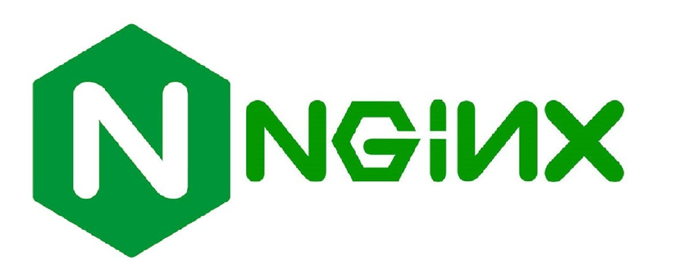
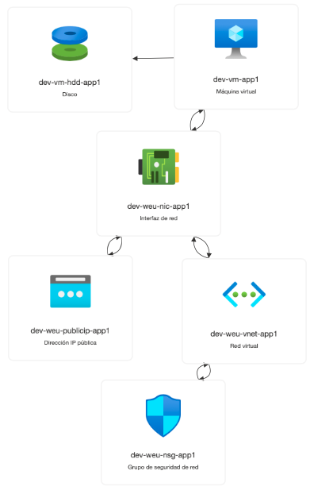
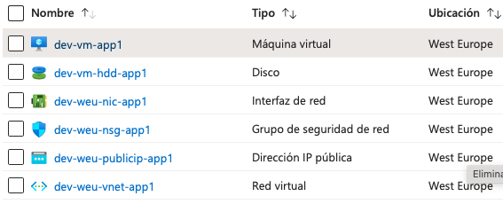
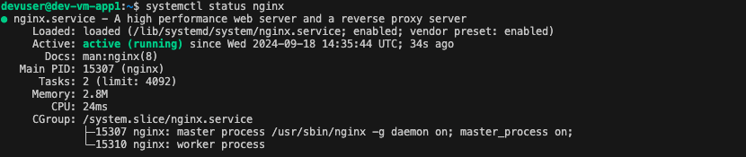

# Despliegue de infraestructura mediante Terraform y configuracón de Servidor Nginx.

<p align="center"></p>

Se desea implementar un sitio web en una cuenta de Azure. Para ello, se planea desplegar una instancia de máquina virtual (VM) en Azure e instalar NGINX en ella. La configuración adicional de NGINX será realizada por el equipo de desarrollo posteriormente. Además, es necesario abrir los puertos 80 (HTTP) y 22 (SSH) para permitir el acceso y la configuración de la VM. Este despliegue se realizara en un entorno de desarrollo y no de producción.


## ¿Qué es Nginx?

Nginx es un servidor web de código abierto que también se utiliza como servidor proxy inverso, balanceador de carga, caché HTTP y más. 
Principales funciones de Nginx:

- Servidor web
- Proxy Inverso 
- Balanceador de carga
- Caché de contenido
- Servidor de correo


## Requisitos para el proyecto.

Los requisitos de un proyecto son esenciales para definir qué se necesita para cumplir con los objetivos y entregables del proyecto. Estos pueden variar dependiendo del tipo de proyecto. En este caso los requisitos que vamos a necesitas son:

- Proveedor: Azure es la plataforma de servicios en la nube de Microsoft, ofrece una amplia gama de productos y servicios para desarrollar, implementar y gestionar aplicaciones a través de una red global de centros de datos. 

- Recursos: Son los componentes fundamentales que se pueden crear y administrar desde Azure. En nuestro caso desplegaremos los siguientes:
    - Grupo de Recursos: Es una entidad que agrupa todos los recursos, lo que facilita la gestión y administración.
    - Virtual Network (VNet) y Subnet: Define la red virtual y la subred que usará la VM.
    - Network Security Group (NSG): Configura las reglas de seguridad para abrir los puertos 80 (HTTP) y 22 (SSH).
    - Network Interface (NIC): Conecta la interfaz de red con la subred y el grupo de seguridad.
    - Public IP: Es una dirección única asignada a un recurso que puede ser accedida desde fuera de la red de Azure, por ejemplo, desde Internet.
    - Virtual Machine (VM): Desplegar la máquina virtual (VM) con sistema operativo Debian, en su ultima version. Utilizaremos varios valores que se toman de variables (como nombre, tamaño, red, etc.) y asigna una interfaz de red existente a la VM. El tamaño es DS1_v2 ya que es una opción sólida para ejecutar un servidor NGINX de aplicaciones web con tráfico bajo a moderado.
    

- Llaves SSH (para que se pueda acceder a la VM)
    - Vamos a configurar el acceso SSH que es un método de conexión segura a VM, de forma encriptada, mediante un par de claves RSA (Publica y Privada)
    - Clave privada: Esta clave se guarda de manera segura en la máquina local / Clave Privada: Esta clave se coloca en el servidor o VM.
    - Para generar ejecutamos el siguiente comando en nuestra terminal "ssh-keygen -t rsa -b 4096", guardamos las claves.
    - Finalmente configuramos nuestra Clave Publica en la VM, en este caso como estamos automatizando, lo haremos mediante Terraform, pasando a traves de una variable el path donde se encuentra nuestra llave publica (~/.ssh/id_rsa.pub) para hacerlo mas flexible. El contenido de ese archivo se pasa como parte de la configuración.
    - Cuando Terraform despliega la máquina virtual en Azure, se encarga de que la clave pública SSH sea copiada al archivo ~/.ssh/authorized_keys de nuestra VM.

- El despliegue de NGINX en la VM se realizará con Terraform, aunque no es la mejor opción para configurar software dentro de la VM. Para configuraciones más complejas o la gestión de múltiples servidores, se recomienda usar herramientas como Ansible. Alternativamente y en este caso, se optará por usar el recurso custom_data (Cloud-init) para hacerlo de forma simple y rápida. La idea es almacenar el script en un archivo externo (setup.sh) y luego referenciarlo desde el código Terraform usando una función e incluir su contenido en la configuración de custom_data.

- Vamos a utilizar los tags (etiquetas) en Azure para organizar y gestionar recursos de manera eficiente. Son pares clave-valor que permiten identificar, categorizar y agrupar recursos como máquinas virtuales, redes y bases de datos, facilitando su administración en entornos grandes.


<div align="center">
  <table>
    <tr>
      <td></td>
      <td></td>
    </tr>   
  </table>
</div>
<div align="center">
  <table>
    <tr>
      <td></td>        
    </tr>   
  </table>
</div>

## Herramientas.

Para desplegar un proyecto en un entorno de producción o desarrollo, necesitas un conjunto de herramientas que cubran diversas áreas, desde el control de versiones, gestión de infraestructura, orquestación, hasta automatización y monitoreo. A continuación, te detallo las herramientas clave que necesitarás para desplegar este proyecto.

- Tener Git Instalado. 
- Repositorio en GitHub y VisualCode
- CLI Azure (Para interacturar con Azure, es necesaria para conectarnos a nuestra maquina)


## Instalacion GIT

Git es un sistema de control de versiones distribuido que permite a los desarrolladores rastrear los cambios en el código fuente durante el desarrollo de un proyecto. Es una herramienta esencial para gestionar el trabajo colaborativo en proyectos de software, ya que permite que varias personas trabajen en los mismos archivos de código simultáneamente sin conflictos.

Para la instalación en nuestro equipo segumos los pasos que hay en la web de [GIT][3]


## Creacion de Repositorio en GitHub 

GitHub es una plataforma basada en la web que se utiliza para gestionar proyectos de software y controlar versiones del código mediante Git. GitHub permite a los desarrolladores colaborar en proyectos de programación, gestionar versiones del código fuente, y almacenar repositorios de código en la nube.

En este caso vamos a registrarnos, crear nuestra cuenta en [GitHub][1].
Ahora vamos a crear nuestro repositorio Local -> Vamos a documentos u donde queramos tener nuestro proyecto alojado, creamos la carpeta y clonamos el repo con GIT Clone, desde la terminal y ya arrastramos dicha carpeta a VisualCode.


## Instalacion CLI Azure 

La CLI de Azure (Azure Command-Line Interface) es una herramienta multiplataforma que permite interactuar con los servicios de Microsoft Azure mediante comandos desde una terminal o línea de comandos. Esta herramienta es útil para administrar recursos de Azure sin necesidad de utilizar el portal web, y es compatible con Windows, macOS y Linux.

Para la instalacion de CLI de azure seguimos los pasos que podemos encontrar en la web de [HashiCorp][2]. 


## Estructura del proyecto en terraform.

Una buena estructura en un proyecto de Terraform es esencial para garantizar la escalabilidad, mantenibilidad y colaboración eficiente cuando se administran infraestructuras como código (IaC). Una estructura bien organizada facilita la comprensión del proyecto, ayuda a evitar errores, y mejora la productividad, especialmente en equipos que gestionan grandes despliegues de recursos en la nube.

La estructura del proyecto que vamos a seguir en Terraform es la siguiente: 

Terraform Estructura.

 ```plaintext
      📂 Terraform-Azure-AWS
        ┃   ┣ 📂 images
        ┃   ┣ 📂 terraform-proyect-01
        ┃   ┃  ┣ 📂 modules        
        ┃   ┃  ┃  ┣ 📂 networking
        ┃   ┃  ┃  ┃  ┣ 📜 main.tf
        ┃   ┃  ┃  ┃  ┣ 📜 variables.tf
        ┃   ┃  ┃  ┃  ┗ 📜 outputs.tf  
        ┃   ┃  ┃  ┣ 📂 resource-group
        ┃   ┃  ┃  ┃  ┣ 📜 main.tf
        ┃   ┃  ┃  ┃  ┗ 📜 variables.tf
        ┃   ┃  ┃  ┣ 📂 virtual-machines
        ┃   ┃  ┃  ┃  ┣ 📜 main.tf
        ┃   ┃  ┃  ┃  ┣ 📜 variables.tf
        ┃   ┃  ┃  ┗  ┗ 📜 setup.sh
        ┃   ┃  ┣ 📜 .terraform.lock.hcl
        ┃   ┃  ┣ 📜 main.tf
        ┃   ┃  ┣ 📜 providers.tf
        ┃   ┃  ┣ 📜 outputs.tf
        ┃   ┃  ┣ 📜 README.md
        ┃   ┃  ┣ 📜 terraform.tfstate
        ┃   ┃  ┣ 📜 terraform.tfvars
        ┃   ┃  ┗ 📜 variables.tf
        ┃   ┣ 📜 .gitignore
        ┗   ┗ 📜 README.md 
```

Vamos a explicar detalladamente para que sirve cada archivo y carpeta. 

- Terraform-project-01: Es la carpeta principal donde se va a alojar nuestros proyectos, tembien es el repositorio de github
- Modules: Esta carpeta se utiliza para guardar todos los modulos los cual posteriormente se invocan desde el archivo main principal, que orquesta toda el despliegue.
- Modulos: Aqui cada modulo lleva un main.tf y un archivo de variables.tf el cual define las variables de entrada que se utilizara en la configuración para parametrizar valores.
- Main.tf: Contiene la definición principal de los recursos que se van a crear en Azure. Es la Plantilla Orquestadora.
- Providers.tf: Define las variables de entrada que se utilizara en la configuración para parametrizar valores como nombres de recursos, ubicaciones, etc.
- Terraform.tfvars: Almacena valores de variables de manera que puedan cambiarse fácilmente sin modificar los archivos .tf.
- Outputs.tf: Define las salidas que Terraform mostrará después de la ejecución, como direcciones IP, nombres de recursos, etc.


[1]: https://github.com
[2]: https://developer.hashicorp.com/terraform/tutorials/azure-get-started/azure-build
[3]: https://git-scm.com/book/es/v2/Inicio---Sobre-el-Control-de-Versiones-Instalación-de-Git


